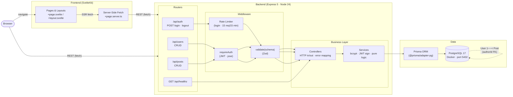

# Discussion Forum

A full-stack, containerized discussion forum with a SvelteKit frontend and a Node.js/Express REST API backed by PostgreSQL.

**Stack:** SvelteKit · Express 5 · Node 24 · TypeScript · Prisma 7 · PostgreSQL 17 · Docker · Zod · JWT (jose)

---

## Architecture

### Data Models

| Model  | Key Fields                                                                    | Relation        |
| ------ | ----------------------------------------------------------------------------- | --------------- |
| `User` | `userId` PK · `email` (unique) · `username` (unique) · `password` (bcrypt)    | has many Posts  |
| `Post` | `postId` PK · `title` · `content` · `authorId` FK · `createdAt` · `updatedAt` | belongs to User |

### Auth Flow

1. `POST /api/auth/login` → rate-limited → Zod validation → `bcrypt.compare` → `SignJWT` (HS256, 24 h)
2. Protected routes → `Authorization: Bearer <token>` → `jwtVerify` → injects `req.user`
3. `POST /api/auth/logout` — stateless; client discards token
